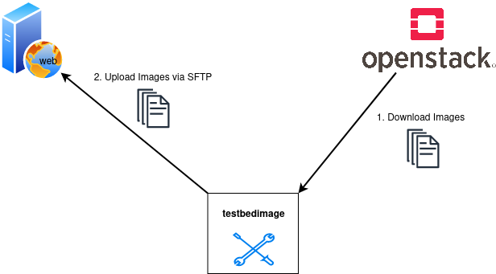

=============
Deploy Images
=============

This command downloads the newest versions of all the images that starts with the image-name defined in the command ``--images`` from the Openstack.
The images are not stored locally but redirected to a location provided by an SFTP-server. A Manifest.json is written after each image-transfer.

Command-Line Options
====================

::

  usage: testbedimage deploy [-h] [-I IMAGES] [-s SSH_SERVER] [-P SSH_PORT] [-u SSH_USER] [-p SSH_PASS] [-k SSH_PASSPHRASE] [-t SSH_DIRECTORY] [-i SSH_KEYFILE] [-d]

  options:
    -h, --help            show this help message and exit
    -I IMAGES, --images IMAGES
                          imagenames seperated by comma
    -s SSH_SERVER, --ssh-server SSH_SERVER
    -P SSH_PORT, --ssh-port SSH_PORT
    -u SSH_USER, --ssh-user SSH_USER
    -p SSH_PASS, --ssh-pass SSH_PASS
    -k SSH_PASSPHRASE, --ssh-passphrase SSH_PASSPHRASE
    -t SSH_DIRECTORY, --ssh-directory SSH_DIRECTORY
    -i SSH_KEYFILE, --ssh-keyfile SSH_KEYFILE
    -d, --debug

.. confval:: -I IMAGES, --images IMAGES

   A comma-seperated list of image-names to check.

   :default: ``atb-videoserver-image,atb-adminpc-image,atb-attacker-image,atb-corpdns-image,atb-fw-inet-lan-dmz-image``

.. confval:: -s SSH_SERVER, --ssh-server SSH_SERVER

   Use this hostname or ip-address to connect via SFTP.

   :type: str

.. confval:: -P SSH_PORT, --ssh-port SSH_PORT

   Use this port to connect via SFTP.

   :type: int
   :default: ``22``

.. confval:: -u SSH_USER, --ssh-user SSH_USER

   Use this username to login to the SFTP-server.

   :type: str

.. confval:: -p SSH_PASS, --ssh-pass SSH_PASS

   Use this password to login to the SFTP-server.

   :type: str

.. confval:: -k SSH_PASSPHRASE, --ssh-passphrase SSH_PASSPHRASE

   Keyphrase to unlock the keyfile

   :type: str

.. confval:: -t SSH_DIRECTORY, --ssh-directory SSH_DIRECTORY

   Change into this directory on the SFTP-server.

   :type: str
   :default: "."

.. confval:: -i SSH_KEYFILE, --ssh-keyfile SSH_KEYFILE

   Keyfile to use to login to the SFTP-serfver.

   :type: str

.. confval:: -d

   Enables debug-output.
