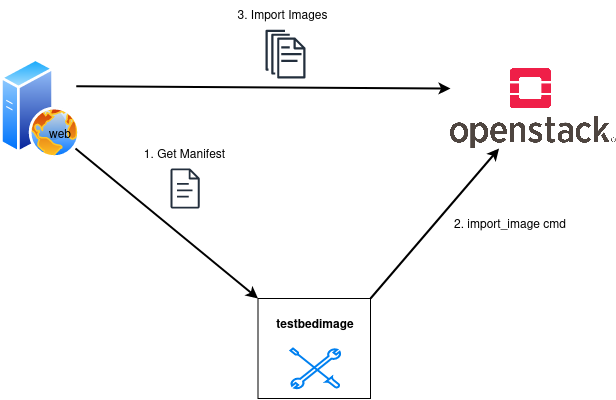

================
Importing Images
================

The ``import_images`` subcommand fetches the manifest from the image-server. It reads
from the manifest file the image locations and starts a web-import for those images
at the Openstack. Even if the testbedimage-tool initiates the web-import, it is important
to know that the Openstack will download the images directly from the image-server.

Command-Line Options
====================

::

  usage: testbedimage import_images [-h] [-I IMAGES] [-u URL] [-d]

  options:
    -h, --help            show this help message and exit
    -u URL, --url URL     url to the images
    -d, --debug

.. confval:: -u URL, --url URL

   The URI to the image-server.

   :default: https://aecidimages.ait.ac.at/current

.. confval:: -d

   Enables debug-output.
