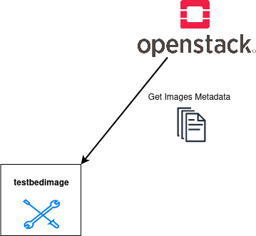

===========
List Images
===========

The ``list_images`` subcommand reads out the images and the state of
the images from the Openstack. This command checks just the newest
versions of images that starts with the name defined with the parameter
``--images``.

Command-Line Options
====================

::

  usage: testbedimage list_images [-h] [-I IMAGES]

  options:
    -h, --help            show this help message and exit
    -I IMAGES, --images IMAGES
                          imagenames seperated by comma

.. confval:: -I IMAGES, --images IMAGES

   A comma-seperated list of image-names to check.

   :default: ``atb-videoserver-image,atb-adminpc-image,atb-attacker-image,atb-corpdns-image,atb-fw-inet-lan-dmz-image``
